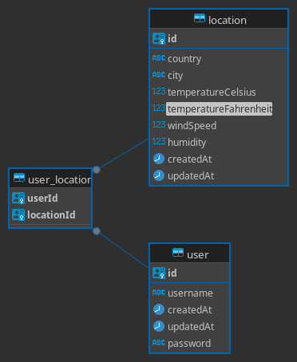

<p align="center">
  <a href="http://nestjs.com/" target="blank"></a>
</p>

[circleci-image]: https://img.shields.io/circleci/build/github/nestjs/nest/master?token=abc123def456
[circleci-url]: https://circleci.com/gh/nestjs/nest

  <p align="center">A progressive <a href="http://nodejs.org" target="_blank">Node.js</a> framework for building efficient and scalable server-side applications.</p>
    <p align="center">
<a href="https://www.npmjs.com/~nestjscore" target="_blank"></a>
<a href="https://www.npmjs.com/~nestjscore" target="_blank"></a>
<a href="https://www.npmjs.com/~nestjscore" target="_blank"></a>
<a href="https://circleci.com/gh/nestjs/nest" target="_blank"></a>
<a href="https://coveralls.io/github/nestjs/nest?branch=master" target="_blank"></a>
<a href="https://discord.gg/G7Qnnhy" target="_blank"></a>
<a href="https://opencollective.com/nest#backer" target="_blank"></a>
<a href="https://opencollective.com/nest#sponsor" target="_blank"></a>
  <a href="https://paypal.me/kamilmysliwiec" target="_blank"></a>
    <a href="https://opencollective.com/nest#sponsor"  target="_blank"></a>
  <a href="https://twitter.com/nestframework" target="_blank"></a>
</p>
  <!--[](https://opencollective.com/nest#backer)
  [](https://opencollective.com/nest#sponsor)-->

## Description

NestJS Weather API Home Test

Objective
Create a NestJS application that serves as a wrapper for a third-party weather API and
provides additional features.

## requirements
1. Set up a new NestJS project.
2. Integrate with a free weather API of your choice (e.g., OpenWeatherMap,
WeatherAPI.com)
3. Implement the following endpoints:
- GET /weather/:city: Retrieve current weather for a given city
- GET /forecast/:city: Retrieve a 5-day forecast for a given city
- POST /locations: Add a location to the user&#39;s favorites
- GET /locations: Retrieve the user&#39;s favorite locations
- DELETE /locations/:id: Remove a location from favorites
4. Besides REST API, Wrap/Provide a couple of services/endpoints using GraphQL.
5. Implement caching to store weather data and reduce calls to the third-pary API.
6. Use the PostgreSQL database to store user favorite locations.
7. Implement rate limiting to prevent abuse of your API
8. Implement proper error handling for API failures and invalid requests.
9. Write unit tests for at least two services.
10. Things must be modularized.
11. IoC and DI must be maintained.

## Bonus Points

- Implement logging.
- Add authentication to protect user-specific endpoints.
- Implement a background job to periodically update weather data for favorite locations

## Submission
- Provide a GitHub repository link with your code.
```bash
$ npm install
```
- Include a README.md file with:
- Setup instructions
```bash
- open you terminal
- install docker and docker compose
- start the sever with 
  $ docker compose up -d --build
- stop the server with
  $ docker compose down

#NOTE: 
#If you have an issue with the docker project starting up. It would be due to the ports that are exposed by the container which being used by other process on the host machine.
```

- Swagger API documentation: [http://localhost:3000/api](http://localhost:3000/api)

- Graphql API documentation: [http://localhost:3000/graphql](http://localhost:3000/graphql)

- Explanation of your caching strategy
```bash
- Use redis to as the store.
- caching only the calls being sent to the external api for an hour
```
- Any assumptions or design decisions you made
```bash
- Implement all the featurees including bonus.
- Unit test were done for couple of files. 
- used docker compose to setup the procject.
- .env file is being psuhed to the repo and injected to the container. In production kept in a secrets manager and induced into the container.
- weatherapi.com is being used and the data sent by them is trimmed to limited values.
- Followed nestjs principles in the short period of understanding the framwework.
- Typeorm and graphql have been kept in modes not suitable for production to enhane the ability for booting the projects.
- In a production enviorment I would include test cases for all code introduced. 
```
## Database design 


Evaluation Criteria
- Code quality and organization
- Effective use of NestJS features and design patterns
- Integration with external API and error handling
- Implementation of caching and rate limiting
- Security considerations (API key management, authentication)
- Testing approach
- Documentation quality

## Project setup

```bash
$ npm install
```

## Compile and run the project

```bash
# development
$ npm run start

# watch mode
$ npm run start:dev

# production mode
$ npm run start:prod
```

## Run tests

```bash
# unit tests
$ npm run test

# e2e tests
$ npm run test:e2e

# test coverage
$ npm run test:cov
```

## Deployment

When you're ready to deploy your NestJS application to production, there are some key steps you can take to ensure it runs as efficiently as possible. Check out the [deployment documentation](https://docs.nestjs.com/deployment) for more information.

If you are looking for a cloud-based platform to deploy your NestJS application, check out [Mau](https://mau.nestjs.com), our official platform for deploying NestJS applications on AWS. Mau makes deployment straightforward and fast, requiring just a few simple steps:

```bash
$ npm install -g mau
$ mau deploy
```

With Mau, you can deploy your application in just a few clicks, allowing you to focus on building features rather than managing infrastructure.

## Resources

Check out a few resources that may come in handy when working with NestJS:

- Visit the [NestJS Documentation](https://docs.nestjs.com) to learn more about the framework.
- For questions and support, please visit our [Discord channel](https://discord.gg/G7Qnnhy).
- To dive deeper and get more hands-on experience, check out our official video [courses](https://courses.nestjs.com/).
- Deploy your application to AWS with the help of [NestJS Mau](https://mau.nestjs.com) in just a few clicks.
- Visualize your application graph and interact with the NestJS application in real-time using [NestJS Devtools](https://devtools.nestjs.com).
- Need help with your project (part-time to full-time)? Check out our official [enterprise support](https://enterprise.nestjs.com).
- To stay in the loop and get updates, follow us on [X](https://x.com/nestframework) and [LinkedIn](https://linkedin.com/company/nestjs).
- Looking for a job, or have a job to offer? Check out our official [Jobs board](https://jobs.nestjs.com).

## Support

Nest is an MIT-licensed open source project. It can grow thanks to the sponsors and support by the amazing backers. If you'd like to join them, please [read more here](https://docs.nestjs.com/support).

## Stay in touch

- Author - [Kamil Myśliwiec](https://twitter.com/kammysliwiec)
- Website - [https://nestjs.com](https://nestjs.com/)
- Twitter - [@nestframework](https://twitter.com/nestframework)

## License

Nest is [MIT licensed](https://github.com/nestjs/nest/blob/master/LICENSE).
